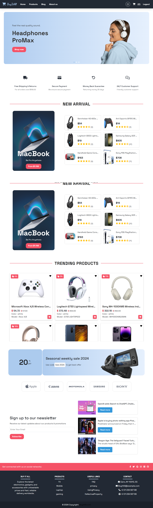
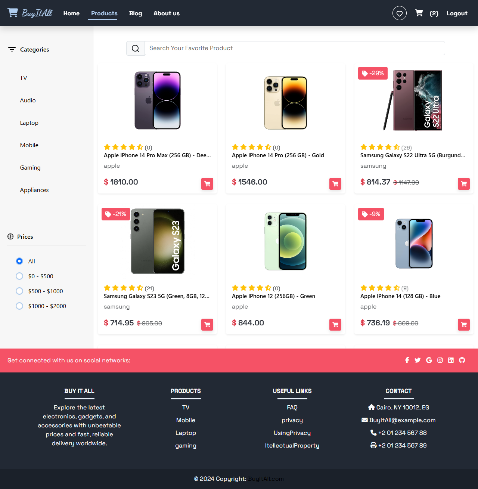
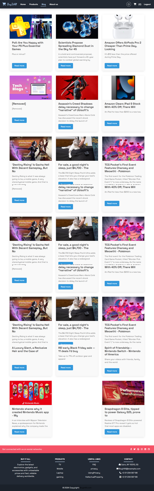

# E-commerceProject-Buy-It-All
Buy It All
A dynamic and responsive e-commerce web application built with modern web technologies to provide a seamless shopping experience. This project showcases advanced features such as product browsing, shopping cart functionality, and secure checkout.

### Features
Product Browsing: Explore a wide range of products with details such as price, description, and discounts.
Search & Filter: Easily find products using search and category filters.
Responsive Design: Optimized for desktops, tablets, and mobile devices.
Shopping Cart: Add, update, and remove items from the cart.
Secure Checkout: Simulated secure payment process.
User Authentication: Sign-up, log in, and manage user sessions.
API Integration: Real-time data fetching for product details and user actions.

### Screenshot

### Technologies Used
Front-End:
React.js
Bootstrap
Framer Motion (for animations)
SCSS
Tailwind CSS (optional for custom styling)

Additional Tools:
Axios (for API calls)
JWT (for authentication)
React Router DOM (for navigation)

### Installation
Clone the Repository
bash
Copy code
git clone https://github.com/Hajerabdeen/E-Commerce-BuyITALL.git
cd E-Commerce-BuyITALL

### Install Dependencies
Front-End:
bash
Copy code
cd client
npm install

### Run the Application
Development Mode:
Start the front-end server:
bash
Copy code
cd client
npm start

### Production Build:
Build the front-end:
bash
Copy code
cd client
npm run build

Usage
Open the application in your browser at http://localhost:3000.
Browse products, add them to the cart, and proceed to checkout.
Log in or sign up to complete the purchase.

### Folder Structure
bash
Copy code
E-Commerce-BuyITALL/
├── client/                  # React front-end  
│   ├── src/                 
│   │   ├── components/      # Reusable UI components  
│   │   ├── pages/           # Page-specific components  
│   │   ├── assets/          # Images, styles, etc.  
│   │   ├── utils/           # Helper functions  
│   │   └── App.js           # Main application component  
├── server/                  # Node.js back-end  
│   ├── routes/              # API routes  
│   ├── models/              # Database models  
│   ├── middleware/          # Authentication and error handling  
│   └── server.js            # Main server file  
└── README.md                # Project documentation  

### API Endpoints
Products
GET /api/products: Fetch all products
GET /api/products/
: Fetch a single product by ID
User Authentication
POST /api/auth/register: User registration
POST /api/auth/login: User login
Cart
POST /api/cart: Add item to cart
GET /api/cart: Retrieve cart items
DELETE /api/cart/
: Remove item from cart
Contributing
Feel free to fork the repository and submit pull requests. Contributions are welcome!

License
This project is licensed under the MIT License.

### Contact
Developer: Hajer Abdeen
Email: hajeradeen286@gmail.com
LinkedIn: http://www.linkedin.com/in/hajer-abdeen-70753a283
